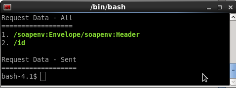

#SOAP Request Builder
A command line interface for soap request sending.

#Installation
##Prerequisites
soap-request-builder software requires Linux OS and this has been tested in CentOS 6.6 only.

##Installation Steps
1. Download and install following software from the web.
    1. xmlstarlet - tested version is 1.5.0
    2. curl - tested version is 7.19.7 (x86_64-redhat-linux-gnu)
    3. ant - tested version is 1.8.2
    4. java - tested version is 1.7

2. Pull the master branch of the soap-request-builder software from github to a local folder

   `cd /home/srbuser/soap-request-builder/`
   
   `git pull https://github.com/chinthakaak/soap-request-builder.git`

3. Execute local installation shell script from soap-request-builder local location.

    `./local-clean-install.sh`

#Your First SOAP Request
After the successful installation of soap-request-builder command line interface(CLI) application, you are ready to execute your first soap request using the terminal.

There are two free web service endpoints have been pre-configured for testing and getting started with this CLI. These have been set in `conf/ws.list` file.

All the service methods for the list of services are auto generated as shell scripts in `scripts` folder and those can be customized using various command line options.

1. http://www.predic8.com:8080/crm/CustomerService

2. http://www.webservicex.net/globalweather.asmx

You need to follow below steps to test the CustomerService web endpoint.

1. `cd scripts/crmCustomerService/`

2. `./get.sh -l`

3. `./get.sh -add 2=1`

4. `./get.sh`

You will see the soap response as follows.

